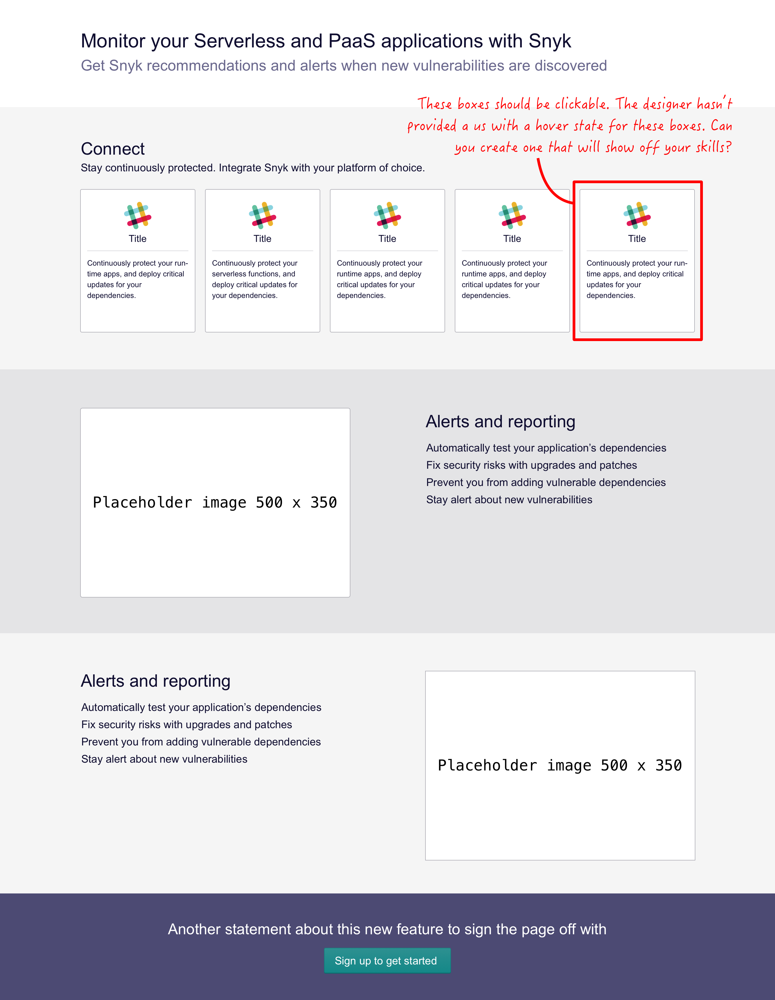

### Exercise

This excercise is to assess your skills in front-end development. It is similar to a typical task you would work on at Snyk.

You are given the attached design and asked to turn it into a webpage. It's intended as a standalone page.

You can use whatever tools/preprocessors you are most comfortable with, or you can use just pure HTML and CSS.

We've simplified the design in an effort to make it quicker for you to build. Don't worry about exact measurements or getting the colours or text the same as the mockup – use your own judgement for this. The mockup uses Arial for ease of building. Use placeholder images such as from https://placekitten.com/ rather than worring about getting the right image.

#### Things to consider

  1. As a distributed team, documentation is really important to us. We'll be impressed by inline comments or well-written documentation that goes alongside it. In particular, we'll need to know how to view your example locally!
  2. We love code that is easy to reuse, remix and maintain.
  3. We're particularly interested in how you approach building the layout as a whole.

#### Implementation

  1. You can either build this as a single HTML page with the CSS in it, or create it as a series of files.
  2. Make sure the page is responsive – it should adapt to small screened devices. How you approach this is up to you.

Don't spend too long on this – we appreciate that this is your own time and we don't want to take up more than is necessary. Anything you don't have time to do we can talk through how you'd implement it instead. And if there's something you're struggling with, make a note and move on. At Snyk, you'd have a whole team to support you when you get stuck.

When you're finished, let us know and we'll go through your example together. Talk to us about the bits you found easy, the bits you found hard, and how you'd improve your solution if you had more time.

Any questions? Let us know!

✨ Good luck! ✨
